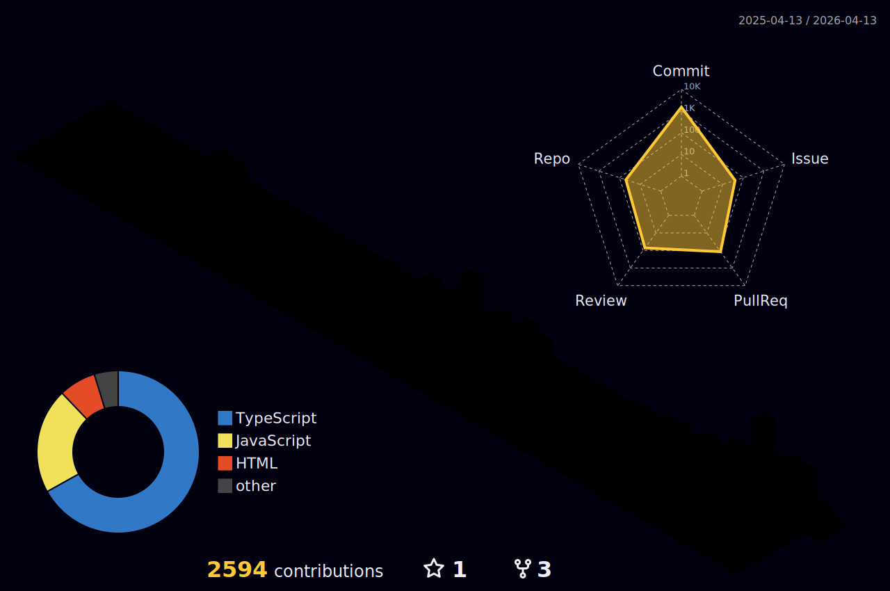

  

  React · TypeScript · UI Architecture · UX

---

## 💡 Introduction

Hi, I'm **Kyungbok**, a Frontend Developer driven by precision and user-centric design.

I specialize in **React** and **TypeScript**, focusing on crafting intuitive UIs and scalable frontend architectures that facilitate seamless team collaboration. 

Beyond just "coding a screen," I strive to understand:
- Why a specific component structure is necessary.
- Where the state and responsibility should reside for optimal performance.
- How to write code that is self-explanatory for fellow developers.

> I am evolving into a developer who doesn't just build, but **communicates intent** through every line of code.

---

## 🎯 What I’m Focusing On

- **Component Design**: Engineering from a UI/UX perspective.
- **Scalability**: Structuring code for reusability and future growth.
- **Real-world Logic**: Implementing features based on actual service flows.
- **Continuous Growth**: Consistent improvement through documentation and retrospection.

---

## 🛠 Tech Stack

### Frontend & Interaction

### Backend & Systems (Learning)

---

## 📊 GitHub Contributions (3D)

---

## 🚀 Selected Projects

### 🎬 OzFlix — Movie Platform
A comprehensive movie discovery service powered by the TMDB API.
- Debounce-based search UX for optimized performance.
- Infinite scroll for seamless content exploration.
- Social login and "Favorite" features with Supabase.
- Fully responsive UI design.

**Tech Stack:** React, JSX, TailwindCSS, Supabase

---

### 💰 Personal Finance Manager
An AG Grid-powered financial management system for heavy data handling.
- Efficient Income/Expense tracking.
- Excel Import/Export functionality.
- Change history tracking and high-performance table optimization.

**Tech Stack:** React, TypeScript, AG Grid, json-server

---

### 📍 Location-based Restaurant App
A map-integrated service for discovering local eateries.
- Real-time location-based exploration.
- Naver Maps API integration with interactive modals.
- Smooth UI animations with Framer Motion.

**Tech Stack:** React, TypeScript, Framer Motion

---

## 📬 Contact & Links

- **Email**: [kyeongbok_0627@kakao.com](mailto:kyeongbok_0627@kakao.com)
- **Blog**: [Velog (yoonddubi)](https://velog.io/@yoonddubi)
- **GitHub**: [kyung-bok](https://github.com/kyung-bok)

---

  Focused on fundamentals. Improving step by step.

